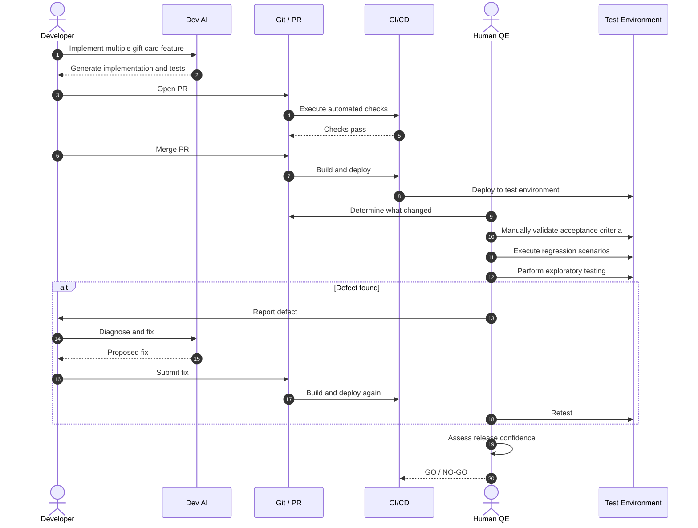
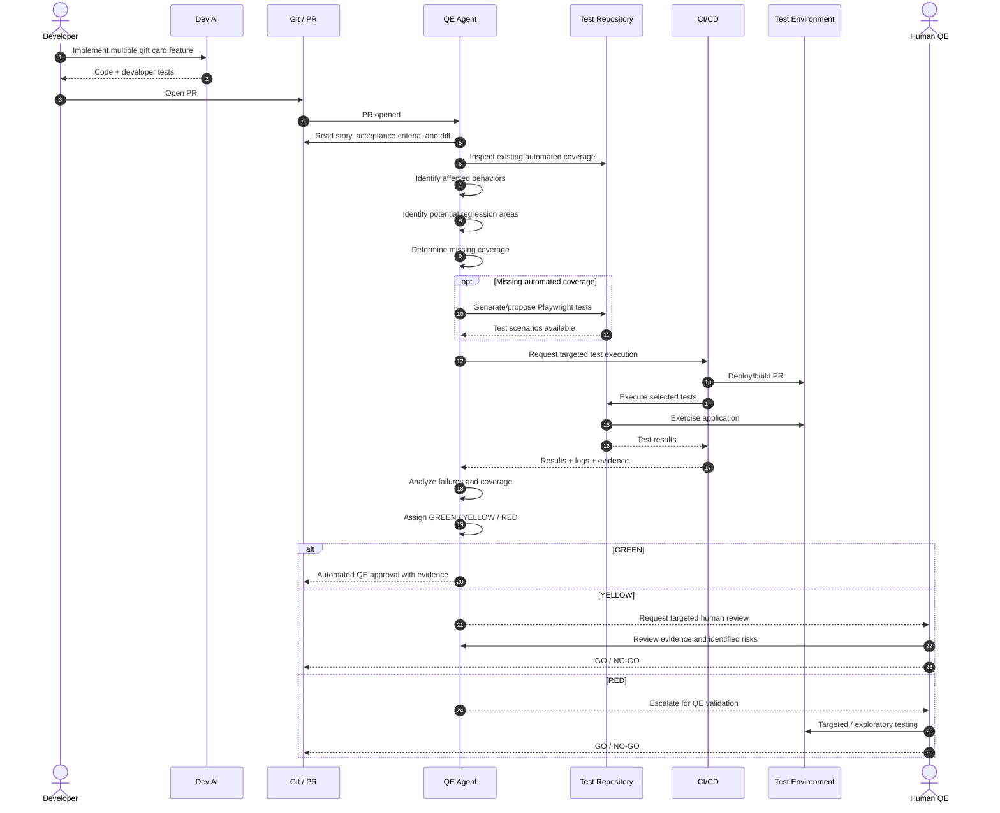
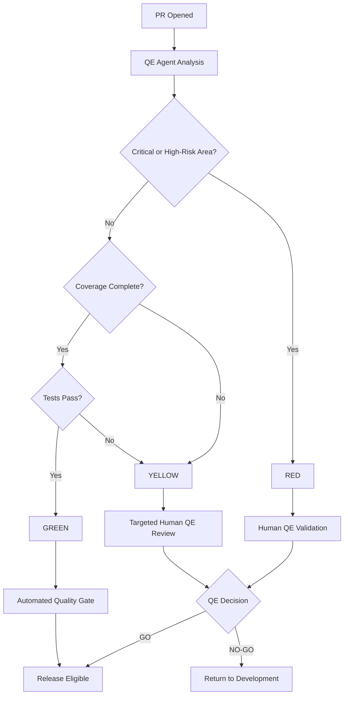
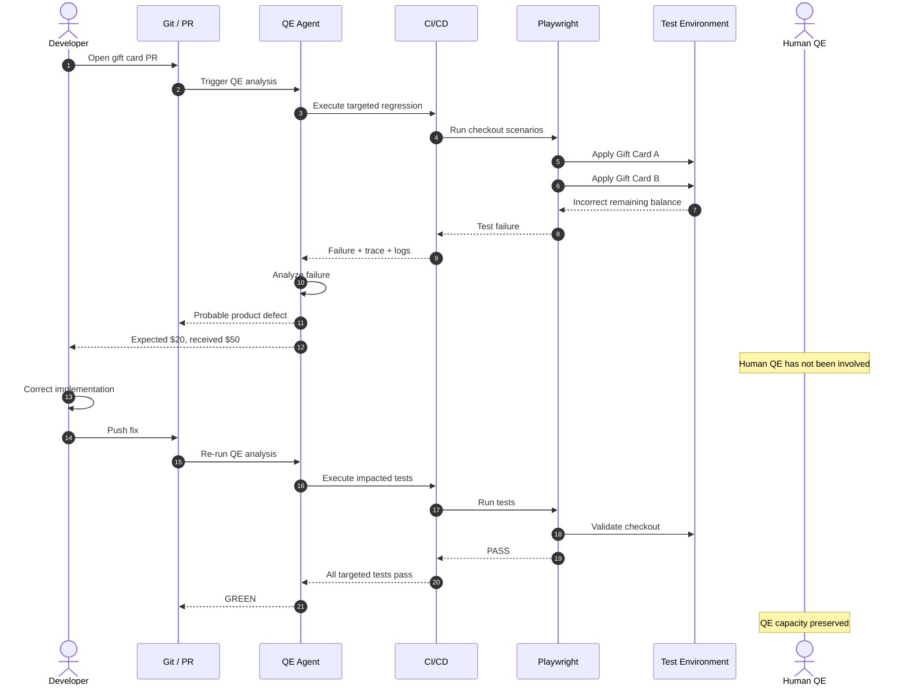
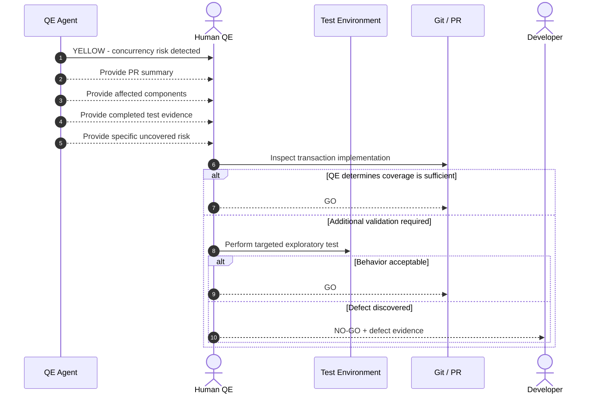
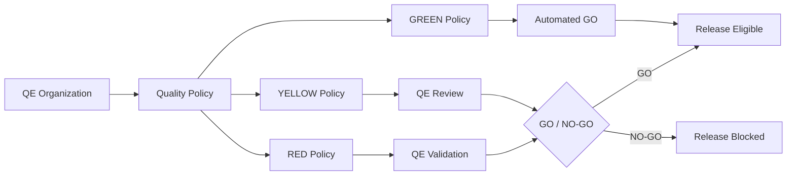
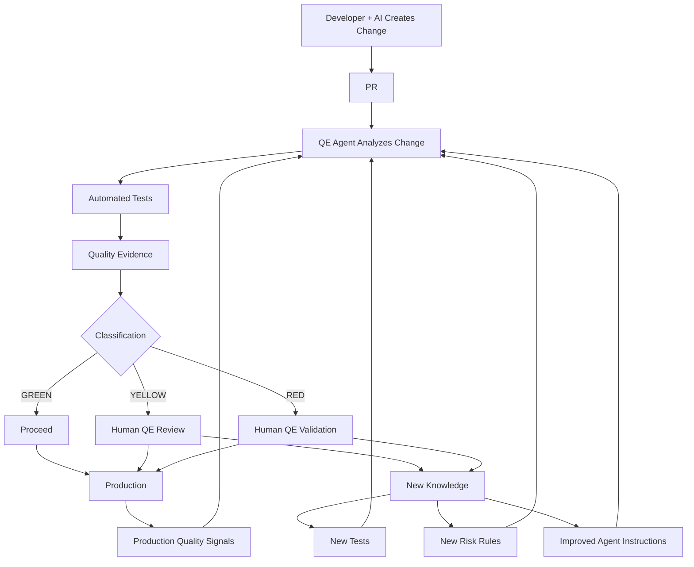
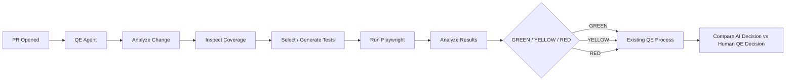

# AI-Enabled Quality Engineering Operating Model

## Purpose

As AI-assisted development increases engineering throughput, a traditional Quality Engineering model can become a bottleneck:

```text
Development → PR → Merge → QE Testing → Release
```

The objective is **not to eliminate QE or remove QE's Go/No-Go responsibility**.

The objective is to change how QE establishes confidence.

> **Developers own quality. QE owns confidence. AI and automation produce the majority of the evidence required to establish that confidence.**

Human QE effort should increasingly be concentrated on risk, exceptions, exploratory testing, and release decisions rather than repetitive execution of known test cases.

---

# 1. Example Feature

This document uses the following feature throughout:

> **Allow a customer to apply multiple gift cards to an order.**

Example acceptance criteria:

1. A customer can apply multiple valid gift cards to an order.
2. Gift cards are applied sequentially until the order balance reaches zero.
3. Gift-card value cannot cause the amount paid to exceed the order total.
4. Invalid gift cards are rejected without affecting previously applied cards.
5. Exhausted gift cards cannot be applied.
6. If gift cards do not cover the complete order, the remaining balance can be paid using another payment method.
7. The final order total and payment allocations must be accurate.

This is a useful example because the implementation may appear relatively small while the potential impact includes:

* Checkout
* Gift-card balances
* Payment allocation
* Order totals
* Refunds
* Payment services
* Concurrency
* Existing single-gift-card behavior

---

# 2. Traditional QE Process

In a traditional SDLC, the sequence often resembles the following.



## The Scaling Problem

AI has significantly accelerated the left side of this process.

Development may now produce multiple features and PRs in the amount of time previously required to produce one.

QE, however, still receives work approximately like this:

```text
Feature
   ↓
Understand change
   ↓
Determine what to test
   ↓
Find/create tests
   ↓
Execute tests
   ↓
Investigate failures
   ↓
Regression
   ↓
Determine confidence
```

Using AI interactively helps QE perform each activity faster, but **QE remains in the critical path**.

For example, if development produces 25 PRs per day and QE spends an average of only 30 minutes validating each PR:

```text
25 PRs × 30 minutes = 12.5 QE hours/day
```

That consumes approximately 1.5 FTE of QE capacity simply processing changes.

The problem therefore cannot be solved solely by making individual QE engineers faster.

The process itself must change.

---

# 3. Target Operating Model

The target model changes the role of QE from:

> **QE performs the testing.**

to:

> **QE designs and operates the system that establishes release confidence.**

The desired flow becomes:

```text
Developer + AI
      ↓
     PR
      ↓
QE Agent
      ↓
Risk + Coverage Analysis
      ↓
Automated Testing
      ↓
Evidence
      ↓
GREEN / YELLOW / RED
      ↓
Human QE only where necessary
```

The key design principle is:

> **Every change receives QE analysis. Not every change requires a human QE engineer.**

---

# 4. Example: Multiple Gift Cards

Assume the developer receives the following story:

> Allow a customer to apply multiple gift cards to an order.

The developer uses an AI coding agent to implement the feature.

The developer and AI are responsible for implementation-level quality, including:

* Unit tests
* Component tests
* API tests where appropriate
* Acceptance criteria implementation
* Basic negative scenarios

The developer then opens a PR.

At this point, the **QE Agent automatically begins its work**.

---

# 5. PR-Level QE Sequence



---

# 6. What the QE Agent Does

The QE Agent should not simply be a chatbot that helps a QE engineer write tests.

It should operate automatically as part of the SDLC.

For every PR, it receives:

```text
Story / Requirements
        +
Acceptance Criteria
        +
PR Diff
        +
Existing Tests
        +
Relevant Architecture Context
        +
Historical Quality Information
        ↓
     QE AGENT
```

For the multiple-gift-card feature, the agent might produce the following analysis.

## Behavior Identified

```text
✓ Multiple gift cards can be applied
✓ Cards must have available balances
✓ Order cannot be overpaid
✓ Invalid cards must be rejected
✓ Exhausted cards must be rejected
✓ Remaining balance can use another payment method
✓ Payment allocations must equal the order total
```

## Existing Coverage

```text
✓ Single gift card checkout
✓ Gift card + credit card
✓ Invalid gift card
✓ Exhausted gift card
```

## Missing Coverage

```text
NEW: Two valid gift cards
NEW: Three valid gift cards
NEW: Gift card balances exceeding order total
NEW: Invalid second gift card
NEW: Gift cards + remaining credit-card balance
```

The agent can generate or propose the necessary Playwright tests.

---

# 7. AI-Generated Playwright Coverage

For example, the QE Agent might determine that a new scenario is required:

```text
Customer has:

Order total:        $100
Gift Card A:         $30
Gift Card B:         $50

Expected:

Gift Card A applied: $30
Gift Card B applied: $50
Remaining balance:   $20
```

The agent generates or updates the Playwright test and submits it through the normal source-control process.

The QE Agent then executes the relevant regression set rather than executing every possible test.

Example:

```text
Checkout tests
    ├── Standard credit card
    ├── Single gift card
    ├── Multiple gift cards        ← NEW
    ├── Gift card + credit card
    ├── Invalid gift card
    └── Exhausted gift card

Payment allocation tests
    ├── Full payment
    ├── Partial payment
    └── Multiple payment sources   ← IMPACTED
```

---

# 8. The Agent Should Also Look for What Nobody Asked For

Generating tests directly from acceptance criteria is useful, but insufficient.

A good QE Agent should also reason about **what could go wrong outside the explicit requirements**.

For the gift-card feature, it might identify:

```text
Potential risk:

Two checkout sessions attempt to redeem the
same gift card at approximately the same time.

Possible result:

Gift card balance could be overspent if balance
validation and redemption are not atomic.
```

The agent could therefore report:

```text
QUALITY RISK DETECTED

Area:
Gift Card Redemption

Risk:
Concurrent redemption may allow a gift card balance
to be consumed by multiple transactions.

Existing Coverage:
None detected.

Recommendation:
Human QE review or additional integration test.

Classification:
YELLOW
```

This is where human QE becomes valuable.

The QE engineer is no longer spending time verifying that:

> "Two gift cards appear on the checkout screen."

Automation already established that.

Instead, QE spends time asking:

> "Could this implementation create a financial integrity problem?"

---

# 9. GREEN / YELLOW / RED Classification

Every PR receives a QE classification.



## GREEN

A GREEN change means:

* Automated coverage is sufficient.
* Relevant tests passed.
* No significant unexplained quality risk exists.
* No high-risk business capability was changed.

Typical human QE effort:

```text
0 minutes
```

QE has still exercised authority because **QE defines the policy allowing GREEN changes to proceed automatically**.

---

## YELLOW

A YELLOW change means the automated system cannot establish sufficient confidence.

Examples:

* Missing coverage
* Unusual business logic
* Ambiguous acceptance criteria
* Unexpected regression impact
* Agent uncertainty
* Potential concurrency problem
* Significant UI behavior change

Typical human QE effort:

```text
10–30 minutes
```

The QE engineer receives the evidence and specific reason for escalation.

They do not restart testing from scratch.

---

## RED

RED indicates a change requiring deliberate human QE involvement.

Examples could include:

* Payment processing
* Authentication/authorization
* Major data migration
* Financial calculations
* Critical customer journey
* Large architectural change
* High-impact production defect
* Significant compliance implication

Typical human QE effort might be:

```text
30–120+ minutes
```

RED should represent a relatively small percentage of overall engineering changes.

---

# 10. Gift Card Example Classification

The initial PR might be classified as YELLOW.

```text
PR #4821
Multiple Gift Card Support

Automated QE Result
-------------------

Acceptance Criteria Coverage: 7/7

Existing Tests Used:          14
New Tests Generated:           5

Tests Passed:                 19
Tests Failed:                  0

Affected Critical Journey:
Checkout

Identified Risk:
Concurrent redemption behavior not covered.

Risk Classification:
YELLOW

Recommended Human Action:
Review transaction handling for concurrent
gift-card redemption.

Estimated QE Effort:
15 minutes
```

A QE engineer reviews the implementation and determines that gift-card redemption is protected by an atomic transaction.

They may request an integration test proving the behavior.

Once that test passes:

```text
QE DECISION: GO
```

The next PR touching a similar path may now be automatically covered by that test.

This is important:

> **Human QE work should create reusable organizational confidence whenever possible.**

The result of the 15-minute investigation should not disappear when the PR closes.

It should improve the automated quality system.

---

# 11. Failure Sequence

If the automated testing discovers a defect, the process should ideally return directly to development without first consuming human QE capacity.



This is a critical source of leverage.

A defect that automation can identify and explain should ideally complete this loop:

```text
Dev
 ↓
AI QE
 ↓
Failure
 ↓
Dev
 ↓
Fix
 ↓
AI QE
 ↓
Pass
```

without requiring a human QE engineer.

---

# 12. Human QE Escalation Sequence

Human QE enters when judgment is required.



The key difference from the traditional process is that QE receives:

```text
Evidence + Risk + Recommendation
```

instead of simply:

```text
A new build that needs testing.
```

---

# 13. Role of QA

QA and QE should not necessarily perform identical functions.

With limited staffing, human QA capacity is particularly valuable for **product-oriented and exploratory validation**.

QA should concentrate on questions such as:

```text
What would a real customer do?

What happens when the workflow is used incorrectly?

Are the requirements actually correct?

Does this behavior make sense?

What happens across features?

What assumptions did developers make?

What scenarios did nobody think to automate?
```

For the gift-card example, QA might deliberately explore:

```text
Apply card A
Remove card A
Apply card B
Reapply card A
Change cart quantity
Apply promotional code
Navigate backward
Refresh browser
Open another checkout session
Retry payment
Cancel payment
Return to checkout
```

AI can suggest these scenarios.

The human decides which are interesting and explores the product.

---

# 14. QE Owns the Quality System

Under this model, QE's primary responsibilities become:

### Quality Automation

QE owns:

* Playwright architecture
* Test patterns
* Fixtures
* Test data
* Test reliability
* CI integration
* Flaky-test management
* Test execution strategy

### AI QE

QE owns:

* QE agent instructions
* Agent evaluation
* Test-generation standards
* Coverage analysis
* Risk classification
* Escalation rules
* AI-generated test review policies

### Quality Intelligence

QE determines:

* What constitutes sufficient evidence
* Which systems are high risk
* Which customer journeys are critical
* Which failures block releases
* Which conditions require human review

### Human Quality Assurance

QE/QA humans concentrate on:

* Exploratory testing
* Complex business rules
* Novel scenarios
* High-risk functionality
* Exceptions
* Release confidence

---

# 15. QE Still Owns Go / No-Go

Automation does not eliminate QE authority.

Instead, QE defines the policy under which releases may proceed.



A GREEN classification therefore does **not** mean QE was bypassed.

It means:

> QE previously established the criteria under which the automated quality system is authorized to issue a GO decision.

This is analogous to other engineering control systems.

Humans establish policy.

Automation executes policy.

Humans handle exceptions.

---

# 16. Capacity Model

Assume AI-assisted development produces:

```text
25 PRs/day
```

Under the traditional model:

```text
25 PRs
×
30 minutes average QE effort
=
12.5 QE hours/day
```

Under a risk-based AI QE model, assume:

```text
15 GREEN
 8 YELLOW
 2 RED
```

Human QE effort becomes approximately:

```text
GREEN

15 × 0 minutes
= 0 hours


YELLOW

8 × 15 minutes
= 2 hours


RED

2 × 60 minutes
= 2 hours


TOTAL

~4 QE hours/day
```

This represents roughly:

```text
Traditional: 12.5 hours/day

AI QE:        4.0 hours/day

Potential human capacity reduction:
~68%
```

The exact percentages are not the objective.

The important metric is:

> **Human QE minutes required per delivered feature.**

If an AI initiative does not reduce this metric while maintaining or increasing release confidence, it is not solving the primary capacity problem.

---

# 17. The AI-SDLC Feedback Loop

The longer-term goal is a continuously improving quality system.



This creates an important organizational effect.

Every time a human QE engineer encounters something the automated system did not understand, the organization asks:

> **Can we teach the quality system to recognize this next time?**

If yes, the human intervention becomes an investment rather than a recurring expense.

---

# 18. What Not to Build Initially

With a small QE organization, this transformation should **not** begin with a large quality-platform initiative.

Do not initially attempt to build:

* Complex quality dashboards
* Enterprise-wide risk models
* Perfect customer-journey maps
* Large AI orchestration platforms
* Fully autonomous test generation
* Sophisticated release scoring
* Dozens of new QE processes

Those could consume the very QE capacity the model is intended to recover.

Start with one narrow feedback loop.

---

# 19. Recommended 30-Day Pilot

Choose:

```text
1 Development Team
1 Repository
1 QE
Existing Playwright Infrastructure
Existing AI Tooling
```

Implement this workflow:



During the pilot, **do not immediately eliminate the existing QE gate**.

Run the new model in parallel long enough to establish trust.

For each PR capture:

```text
Agent classification

Human QE classification

Agent-discovered defects

Human-discovered defects

False positives

False negatives

Human QE minutes spent

Tests generated

Tests retained

Escaped defects
```

The most important question becomes:

> **When the QE Agent says GREEN, how frequently does the human QE engineer subsequently discover something that should have prevented GREEN?**

---

# 20. Graduation

Once the organization establishes sufficient confidence in GREEN classifications, change the workflow.

Before:

```text
GREEN
  ↓
Human QE Testing
  ↓
GO
```

After:

```text
GREEN
  ↓
GO
```

YELLOW and RED continue to consume human QE capacity.

Over time:

```text
          INITIAL             MATURE

GREEN       30%      →         70%+
YELLOW      50%      →         20%
RED         20%      →         10%
```

The exact targets should emerge from actual risk and product characteristics rather than becoming arbitrary KPIs.

The desired trend, however, is clear:

> **A growing percentage of routine software changes should establish release confidence without synchronous human QE involvement.**

---

# 21. Target End State

The transformation can be summarized as:

```text
OLD

Developers
    ↓
Build software
    ↓
QE
    ↓
Test software
    ↓
GO / NO-GO


NEW

Developers + AI
    ↓
Build software + implementation tests
    ↓
QE-owned AI Quality System
    ↓
Analyze risk
    ↓
Generate/select tests
    ↓
Execute validation
    ↓
Collect evidence
    ↓
GREEN ───────────────→ GO
YELLOW → Human QE ───→ GO / NO-GO
RED ───→ Human QE ───→ GO / NO-GO
```

The objective is **not fewer quality controls**.

It is fewer quality controls that require synchronous human labor.

---

# 22. Operating Principle

The model can ultimately be expressed with three statements:

> **Developers own quality.**

> **QE owns the quality system and release confidence.**

> **Humans investigate risk and exceptions; AI and automation handle repetition and evidence gathering.**

For the multiple-gift-card example, success is therefore not that AI can write a Playwright test faster than a QE engineer.

Success is that the organization can take:

```text
"Allow a customer to apply multiple gift cards to an order."
```

through:

```text
Requirement
    ↓
Implementation
    ↓
PR
    ↓
Quality Analysis
    ↓
Automated Validation
    ↓
Risk Assessment
    ↓
Release Decision
```

while requiring **little or no human QE time for routine behavior**, yet still escalating the concurrency, financial-integrity, business-rule, and other difficult questions to the people whose judgment provides the greatest value.

That is the intended role of QE in an AI-accelerated SDLC.
